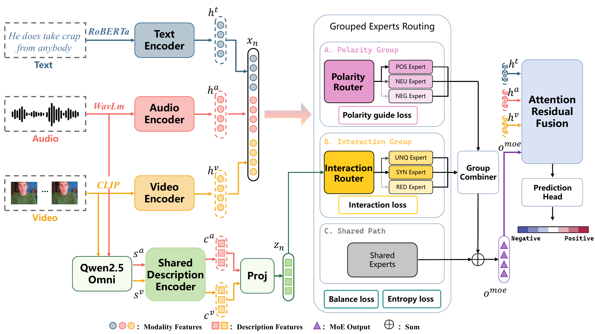
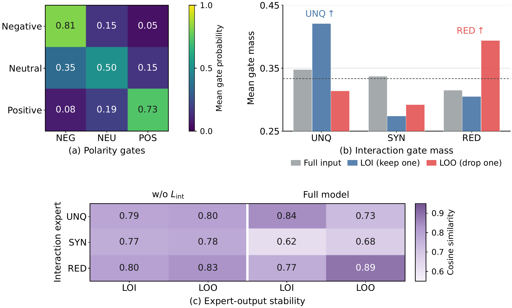

# PIER-MoE

**Polarity-Interaction Expert Routing with Description Guidance for Multimodal Sentiment Analysis**

This repository contains the current public implementation of **PIER-MoE**, a multimodal sentiment analysis framework that predicts sentiment polarity and intensity from text, speech, and visual behavior. PIER-MoE separates two questions in multimodal fusion: **what sentiment an utterance expresses** and **how its modalities contribute evidence**.

> **Release status: partial code release.** The model components and selected supporting utilities are available now. The complete training and reproduction pipeline is not yet included. Additional training scripts and the full audio/video preprocessing code are planned for release after paper acceptance.

## Method overview



*Figure 1. Overall architecture of PIER-MoE. Audio and visual descriptions guide the interaction router, while the experts operate on modality representations.*

PIER-MoE uses RoBERTa, WavLM, and CLIP representations for text, audio, and vision, respectively. Modality representations are projected into a common hidden space and pooled before expert routing. The released model consumes precomputed visual features; CLIP feature extraction is not included in this release.

- **Polarity routing:** POS, NEG, and NEU experts specialize in sentiment polarity. Their router is supervised with soft targets derived from continuous sentiment labels.
- **Interaction routing:** UNQ, SYN, and RED experts are encouraged to model unique, synergistic, and redundant evidence through leave-only-in and leave-one-out modality masking. These are interaction-inspired inductive biases, rather than a formal information decomposition.
- **Description guidance:** Qwen2.5-Omni generates descriptions of observable acoustic and visual behaviors. A separate description encoder supplies guidance directly to the interaction router. In the main configuration, description embeddings are not concatenated into expert inputs or passed to the polarity router; source-description alignment still regularizes modality representations during training.
- **Shared path and fusion:** a shared expert complements the two routed groups. A sample-dependent combiner mixes the groups, and attention-residual fusion combines the routed output with unimodal representations for sentiment regression.

The paper's training objective combines sentiment MAE, auxiliary unimodal regression, source-description alignment, polarity supervision, interaction regularization, and routing balance/entropy terms. This release exposes the model outputs and auxiliary losses; assembling the complete objective, optimization loop, and training schedule requires the training code that is not yet released.

## What is available

| Component | Released files | Scope |
| --- | --- | --- |
| Main PIER-MoE model | [models/model.py](models/model.py), [models/config.py](models/config.py) | Independent description routing, multimodal forward pass, prediction heads, configuration, and optional diagnostics. |
| Polarity and interaction experts | [models/grouped_moe.py](models/grouped_moe.py) | POS/NEG/NEU and UNQ/SYN/RED experts, shared expert, group combination, and routing/masking auxiliary losses. |
| Description encoding and alignment | [models/description_fusion.py](models/description_fusion.py) | Independent audio/visual description embeddings, validity masking, and source-description alignment losses. |
| Supporting model modules | [pier_moe_core/](pier_moe_core/) | Base encoders and configuration, attention-residual fusion, additional MoE variants, description fusion utilities, and a training logger. |
| Data loading | [data/loaders/multimodal_loader.py](data/loaders/multimodal_loader.py) | Loading prepared labels/text, audio, visual features, and description records. |
| Evaluation metrics | [data/metrics.py](data/metrics.py) | Sentiment classification and regression metrics, including MOSI/MOSEI metrics. |
| MLLM description generation | [data/prepare/descriptions_qwen_omni.py](data/prepare/descriptions_qwen_omni.py) | Audio/visual behavior prompts, output validation, and resumable JSONL generation with Qwen2.5-Omni. |
| Selected MOSI settings | [scripts/run_mosi.sh](scripts/run_mosi.sh) | A reference training command and selected hyperparameters. The referenced `train.py` is not included. |

Use the classes exported by **`models`** for the main description-guided architecture. The `pier_moe_core` package supplies inherited components and other variants; importing its base model directly does not select the same description-routing implementation.

### Not included in this release

- The complete training entry point (`train.py`), experiment orchestration, and full multi-seed reproduction scripts.
- The complete dataset preparation pipeline, including audio/video extraction and visual feature extraction.
- Raw MOSI/MOSEI media, labels, extracted features, or generated description files. The [MOSI](data/MOSI/README.md) and [MOSEI](data/MOSEI/README.md) directories currently contain documentation placeholders only.
- Pretrained backbone weights, trained PIER-MoE checkpoints, and experiment logs.
- A pinned dependency specification for reproducing the paper's environment.

**The current repository is intended for inspecting and integrating the released components. Running `scripts/run_mosi.sh` alone will not train the model with this partial release.** Its paths also refer to the original local environment and must be adapted.

## Repository layout

```text
PIER-MOE/
├── assets/figures/             # Paper figures displayed in this README
├── models/                    # Main description-guided PIER-MoE implementation
├── pier_moe_core/              # Shared model building blocks and variants
├── data/
│   ├── loaders/
│   │   └── multimodal_loader.py
│   ├── prepare/
│   │   └── descriptions_qwen_omni.py
│   ├── MOSI/                  # Dataset placeholder
│   ├── MOSEI/                 # Dataset placeholder
│   └── metrics.py
├── scripts/
│   └── run_mosi.sh             # Reference settings; requires unreleased trainer
└── README.md
```

## Using the released components

The source uses PyTorch, Transformers, torchaudio, NumPy, pandas, and scikit-learn. Description generation additionally uses Qwen2.5-Omni support in Transformers and `qwen-omni-utils`. Dependencies and model weights must be prepared separately; no validated, pinned installation environment is bundled yet.

### Model entry point

The following illustrates model construction after dependencies and local backbone weights are available. It is not a complete training example.

```python
from models import PIERMoEConfig, PIERMoEForMER

config = PIERMoEConfig(
    text_model_name="/path/to/roberta-large",
    audio_model_name_or_path="/path/to/wavlm-large",
    desc_text_model_name="/path/to/roberta-large",
    hf_local_only=True,
    use_context=False,
    use_visual=True,
    use_desc=True,
    use_grouped_moe=True,
    use_emotion_moe=True,
    use_local_moe=False,
    route_desc_to_interaction_only=True,
)
config.validate()
model = PIERMoEForMER(config)
```

The forward interface accepts text tokens, audio inputs, precomputed visual features, and the associated masks, plus audio/visual description tokens and validity flags. It returns the multimodal prediction under `M`, optional unimodal predictions under `T`, `A`, and `V`, alignment terms under `_aux_losses`, and MoE auxiliary terms under `_moe_loss` and `_moe_raw_losses`. Set `return_diagnostics=True` to obtain routing and fusion diagnostics. See [models/model.py](models/model.py) for the full interface.

### Description generation

Once media clips and Qwen2.5-Omni dependencies are prepared, the released generator accepts a CSV manifest with `sample_id`, `wav_path`, and `mp4_path` columns. Use sample IDs that match the data loader (`video_id/clip_id`). For example:

```bash
python data/prepare/descriptions_qwen_omni.py \
  --manifest /path/to/manifest.csv \
  --output /path/to/mllm_desc_qwen_omni.jsonl \
  --model /path/to/Qwen2.5-Omni \
  --phase all \
  --resume
```

The JSONL output contains audio/visual descriptions and their status fields. Prompts request observable behavior, such as pitch changes, pauses, and facial/head movements, while excluding emotion labels and sentiment judgments. The media preparation steps required before this command are not included yet.

## Results reported in the paper

The following results are from the submitted manuscript, averaged over five random seeds. They were obtained with the full experimental pipeline, rather than independently reproduced from this partial release. Acc-2 and F1 entries are **Has-0 / Non-0**; accuracy and F1 are percentages.

| Dataset | Acc-2 ↑ | F1 ↑ | Acc-7 ↑ | MAE ↓ | Corr ↑ |
| --- | --- | --- | --- | --- | --- |
| CMU-MOSI | 86.88 / 88.87 | 86.86 / 88.94 | 50.62 | 0.643 | 0.874 |
| CMU-MOSEI | 86.66 / 88.82 | 86.91 / 88.93 | 56.24 | 0.481 | 0.853 |

Under the paper's comparison protocol, PIER-MoE achieves the best results on six of the seven reported measures on both datasets when Has-0 and Non-0 are counted separately, and ranks second on Acc-7. The ablations examine expert grouping, description placement, and attention-residual fusion.

### Routing and interaction behavior



*Figure 2. MOSI routing and masking analysis: (a) mean polarity gates by sentiment; (b) interaction-gate mass; (c) cosine similarity between full-input and masked expert outputs, with and without interaction regularization. LOI retains one modality, and LOO removes one modality.*

The polarity router favors the expert matching each sentiment group. Under masking, UNQ receives more gate mass when only one modality is retained, while RED receives more when one modality is removed. Interaction regularization encourages distinct expert responses: UNQ is more stable under LOI, RED under LOO, and SYN is more sensitive to masking. These results support the intended interaction behaviors without establishing a formal information decomposition.

## Acknowledgments

The metric implementation in [data/metrics.py](data/metrics.py) credits the MMSA project. PIER-MoE also builds on RoBERTa, WavLM, CLIP, and Qwen2.5-Omni, and is evaluated on CMU-MOSI and CMU-MOSEI.
